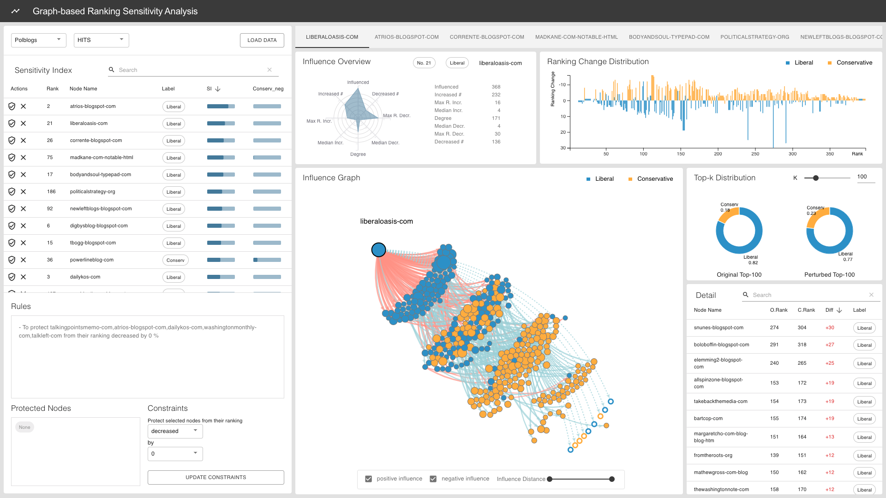

## Auditing the Sensitivity of Graph-based Ranking with Visual Analytics



A visual analytics framework for explaining and exploring the sensitivity of any graph-based ranking algorithms by performing perturbation-based what-if analysis.

### Installing 
There are mainly two ways of installing and running the framework:
- Installing with docker
- Manual Installation

#### Installing with docker
The easiest way to install and run is using docker and docker-compose. Before running, make sure your docker and docker compose is installed and the docker service is on. Please refer to Docker documentation for details.

Once they are installed, simply running the following command under the root of the project:

```
$ docker-compose up
```

For the first-time setup, this should take around 5 minutes.

When the server is on, visit localhost:3000 in your browser. For the best result, please use Chrome. 

#### Manual Installation
If the docker is not available or you prefer manual setup on your local machine, you can try the following instruction.

#####  Prerequisite 
First make sure you have Python and Node installed:

- Python v3.7.6
- Node v12.16.1

##### Setup backend
To setup backend environment, use pip install under the root path:
```
$ pip install -r requirements.txt 
```
To download the data and start the server, enter:
```
$ bash backend_builder.sh
```

##### Setup frontend
To setup frontend environment, user npm install under the frontend folder:
```
$ npm install
```
After that run the following scripts to fix some d3 dependencies:
```
$ bash module_connector.sh
```
Next, change proxy direction in frontend/src/setupProxy.js:
```
app.use(
    '/loadData/*',
    createProxyMiddleware({
        target: 'http://localhost:5000', // originally 'http://backend:5000'
        changeOrigin: true,
        secure: false
    })
);
app.use(
    '/perturb/*',
    createProxyMiddleware({
        target: 'http://localhost:5000', // originally 'http://backend:5000'
        changeOrigin: true,
        secure: false
    })
);
```
Finally, start up the frontend server under frontend folder:
```
$ npm start
```
Visit localhost:3000 in your browser. For the best result, please use Chrome full-screen mode with 1920 x1080 resolution screen.

### License

This project is licensed under the MIT License - see the [LICENSE](LICENSE) file for details
